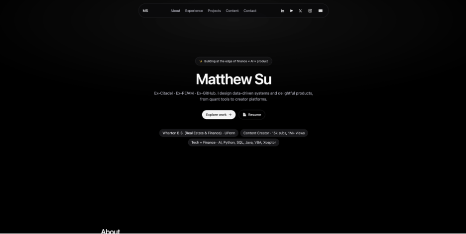

# Matthew Su — Personal Portfolio



## 📄 About
This is my personal portfolio website built with **Vite + React** and styled with **Tailwind CSS**.  
It showcases my background, skills, work experience, selected projects, and writing samples.  
The site is responsive, minimalist, and optimized for fast loading.

🔗 **Live Site:** [https://matthewwsu.github.io/matthew-portfolio/](https://matthewwsu.github.io/matthew-portfolio/)

---

## 🛠 Tech Stack
- **Frontend:** [React](https://react.dev/) (with Vite)
- **Styling:** [Tailwind CSS](https://tailwindcss.com/)
- **Icons:** Custom SVG assets
- **Hosting:** [GitHub Pages](https://pages.github.com/)
- **Deployment:** [`gh-pages`](https://www.npmjs.com/package/gh-pages) npm package

---

## 📂 Features
- **Hero Section** — name, tagline, quick highlights, and CTA buttons
- **About Me** — professional summary and core focus areas
- **Experience** — past roles with bullet-point achievements
- **Selected Projects** — clickable links to repos and demos
- **Writing** — PDFs of valuation write-ups and research papers
- **Contact** — email and LinkedIn buttons
- **Mobile-Friendly** — works across all screen sizes

---

## 🚀 Getting Started (Local Development)

Clone the repo:
```bash
git clone https://github.com/matthewwsu/matthew-portfolio.git
cd matthew-portfolio
